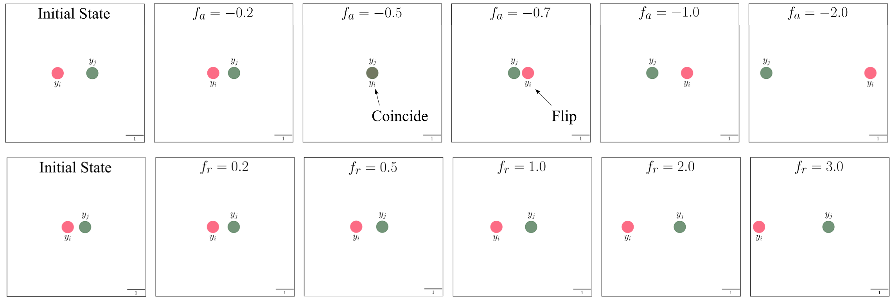
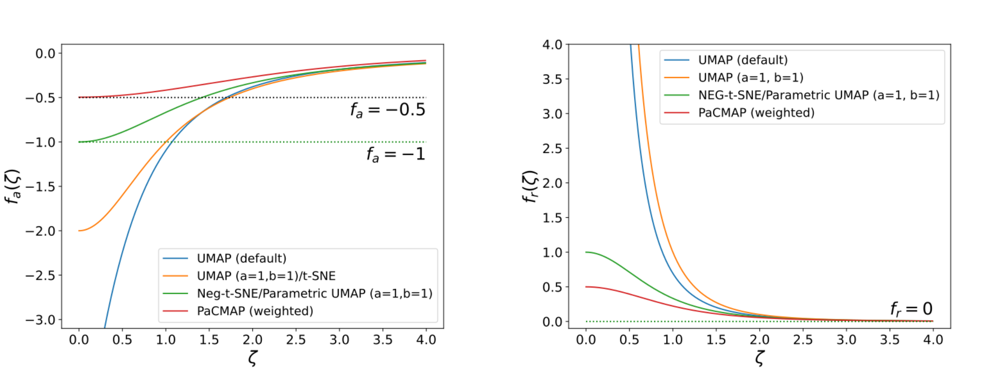

# The Shape of Attraction in UMAP

Code for the TMLR paper:

**The Shape of Attraction in UMAP: Exploring the Embedding Forces in Dimensionality Reduction**

> This repository contains code for analyzing attraction and repulsion forces in UMAP and related dimensionality reduction methods. The main idea is to study the scalar “shape” of attractive and repulsive updates, and use these shapes to explain learning-rate annealing, cluster formation, random-initialization behavior, and the relation between UMAP, NEG-t-SNE, PaCMAP, and related methods.

---

## Overview

UMAP and related neighbor-embedding methods are usually described as algorithms that pull similar points together and push dissimilar points apart. In this work, we make this intuition more explicit by decomposing the update forces into:

- an **attraction shape**, which controls how positive/neighborhood edges move;
- a **repulsion shape**, which controls how negative/non-neighbor edges move.

This decomposition reveals that attraction in UMAP is more subtle than a simple “pull”: depending on the distance and learning rate, attractive updates can either contract or expand the distance between neighboring points. This helps explain why UMAP relies on learning-rate annealing and why random initialization can lead to inconsistent embeddings.

---

## Main ideas

Given two embedding points \(y_i\) and \(y_j\), the attractive and repulsive updates can be written as

$$
y_i^{t+1} = y_i^t + \lambda f_a(\zeta^t)(y_i^t - y_j^t),
$$

and

$$
y_i^{t+1} = y_i^t + \lambda f_r(\zeta^t)(y_i^t - y_j^t),
$$

where $\zeta = ||y_i - y_j||_2$ is the distance, $f_a$ is the attraction shape, and $f_r$ is the repulsion shape.

  

The value of $f_a$ and $f_r$ guides how the distances contract and expand.
 
For UMAP, these shapes are

$$
f_a^U(\zeta) =
\frac{-2ab\zeta^{2(b-1)}}{1 + a\zeta^{2b}},
$$

and

$$
f_r^U(\zeta) =
\frac{2b}{\zeta^{2b}(1+a\zeta^{2b})}.
$$

  

(Left) Attraction, and (Right) repulsion shapes of different algorithms. $-1 < \lambda f_a < 0$ indicates contractions during attractive updates. $-0.5 < \lambda f_a < 0$ causes contractions without flips, whereas $\lambda f_a < -0.5$ causes flips.

The paper shows that:

1. Attractive updates contract distances only when $-1 < \lambda f_a < 0$.

2. UMAP’s attraction shape can violate this condition at small distances, producing local expansion instead of contraction.

3. Learning-rate annealing reduces this instability by pushing the effective attraction shape into a better contraction regime.

4. Increasing long-range attraction improves consistency under random initialization.

5. Repulsion primarily regulates compactness and inter-cluster distance, while attraction plays a central role in forming new cluster structure.

---

