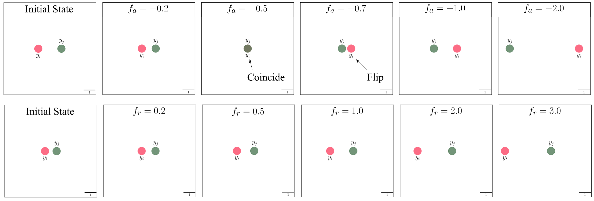
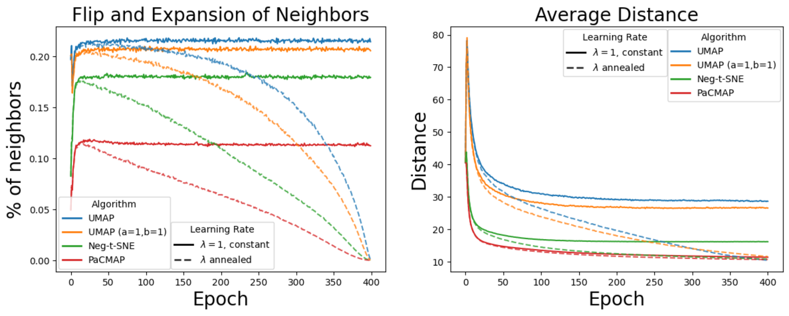
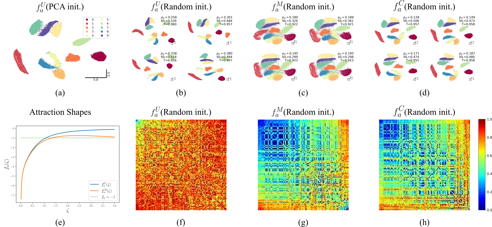
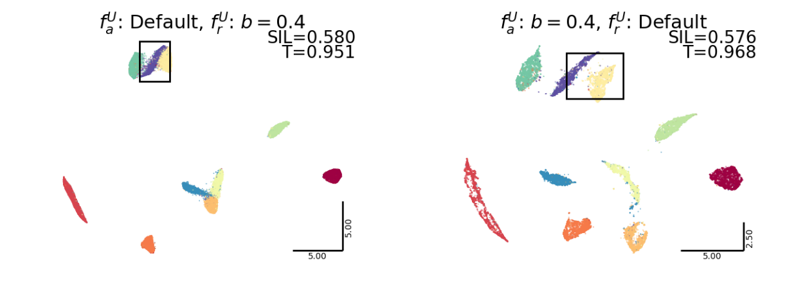

# The Shape of Attraction in UMAP: Exploring the Embedding Forces in Dimensionality Reduction

Code for the [TMLR](https://openreview.net/forum?id=fdPNhqav5G) paper:

**The Shape of Attraction in UMAP: Exploring the Embedding Forces in Dimensionality Reduction**

> This repository contains code for analyzing attraction and repulsion forces in UMAP and related dimensionality reduction methods. The main idea is to study the scalar “shape” of attractive and repulsive updates, and to use these shapes to explain learning-rate annealing, cluster formation, random-initialization behavior, and the relationship between UMAP, NEG-t-SNE, PaCMAP, and related methods.

---

## Overview

UMAP and related neighbor-embedding methods are usually described as algorithms that pull similar points together and push dissimilar points apart. In this work, we make this intuition more explicit by decomposing the update forces into:

- an **attraction shape**, which controls how positive/neighborhood edges move;
- a **repulsion shape**, which controls how negative/non-neighbor edges move.

This decomposition reveals that attraction in UMAP is more subtle than simple contraction: depending on the distance and learning rate, attractive updates can either contract or expand the distance between neighboring points. This helps explain why UMAP relies on learning-rate annealing and why random initialization can lead to inconsistent embeddings.

---

## Main ideas

Given two embedding points $y_i$ and $y_j$, the attractive and repulsive updates can be written as

$$
y_i^{t+1} = y_i^t + \lambda f_a(\zeta^t)(y_i^t - y_j^t),
$$

and

$$
y_i^{t+1} = y_i^t + \lambda f_r(\zeta^t)(y_i^t - y_j^t),
$$

where $\zeta = \lVert y_i - y_j \rVert_2$ is the distance, $f_a$ is the attraction shape, and $f_r$ is the repulsion shape.

<p align="center">
  
</p>

The values of $f_a$ and $f_r$ determine how distances contract and expand.

For UMAP, these shapes are

$$
f_a^U(\zeta) =
\frac{-2ab\zeta^{2(b-1)}}{1 + a\zeta^{2b}},
$$

and

$$
f_r^U(\zeta) =
\frac{2b}{\zeta^{2b}(1+a\zeta^{2b})}.
$$

<p align="center">
  
</p>

**Attraction and repulsion shapes of different algorithms.** Left: attraction shapes. Right: repulsion shapes. The condition $-1 < \lambda f_a < 0$ indicates contraction during attractive updates. The range $-0.5 < \lambda f_a < 0$ causes contraction without flips, whereas $\lambda f_a < -0.5$ causes flips.

<p align="center">
  
</p>

**The attraction shape directly correlates with the internal chaotic behavior of updates.** Shapes that fall below $-0.5$ at small distances cause more flips during optimization than shapes that remain within $[-0.5, 0]$. The attraction shape also affects how neighbor distances contract during optimization.

<p align="center">
  
</p>

**Exploring the optimization landscape by modifying attraction shapes under random initialization.** More blue in the corner indicates more stable optimization outcomes.

<p align="center">
  
</p>

**Controlling granularity and inter-cluster distance by modifying the shapes.** Attraction drives cluster formation, while repulsion controls inter-cluster distance. Modifying them independently can create new clusters or make previously formed clusters more compact.

---

## Citation

If you find this paper or codebase useful, please consider citing our paper:


```bibtex
@article{islam2026shape,
  title={The Shape of Attraction in UMAP: Exploring the Embedding Forces in Dimensionality Reduction},
  author={Islam, Mohammad Tariqul and Fleischer, Jason W},
  journal={Transactions on Machine Learning Research},
  year={2026}
}
```

---
